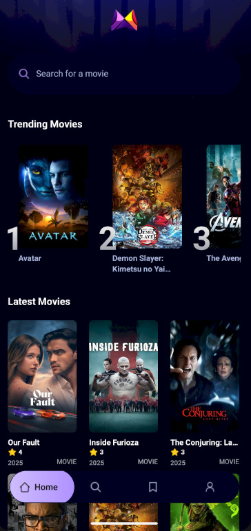
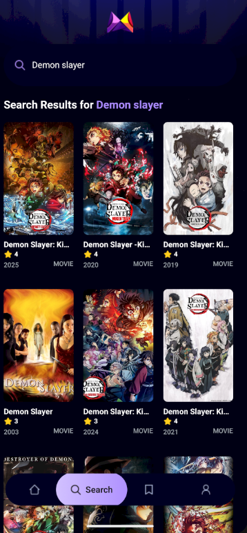

# 🎬 Movie Mate

Movie Mate is a **React Native + Expo** application that helps users discover the **latest and trending movies** effortlessly. It fetches real-time movie data, displays descriptions and posters, and even stores user queries using **Appwrite** — giving users a personalized movie discovery experience.

The **APK** is available in the [Releases section](https://github.com/Nil369/movie-mate/releases/) for easy download.

---

## 🚀 Features

* 🆕 **Latest Movies** – Get up-to-date movie listings as soon as they’re released.
* 🔥 **Trending Movies** – See what’s popular and trending right now.
* 📝 **Movie Descriptions** – Detailed overviews, posters, and other movie info.
* 💾 **Query Storage with Appwrite** – Stores user search queries securely for analytics and personalization.
* ⚡ **Built with React Native + Expo** – Fast, cross-platform mobile app development.

---
# Demo of the App

<div align="center">
  
  
  
</div>

---

## 🛠️ Tech Stack

| Technology                | Purpose                                                               |
| ------------------------- | --------------------------------------------------------------------- |
| **React Native**          | Frontend framework for building the mobile UI                         |
| **Expo**                  | Toolchain for building and deploying the app                          |
| **Appwrite**              | Backend-as-a-service for database and authentication                  |
| **TMDB API (or similar)** | Movie data source (you can replace this with the actual API you used) |

---

## 📦 Installation & Setup

Follow these steps to run the app locally:

```bash
# Clone the repository
git clone https://github.com/Nil369/movie-mate.git

# Navigate to project directory
cd movie-mate

# Install dependencies
npm install

# Start Expo development server
npx expo start
```

Then scan the QR code with the **Expo Go** app on your phone to preview the app.

---

## 🧠 How It Works

1. The user opens the app and browses latest or trending movies.
2. When a user searches for a movie, their query is **stored in Appwrite**.
3. Movie data is fetched from the external API and displayed beautifully with images and descriptions.
4. The app provides a smooth, native-like user experience on both Android and iOS.

---

## 📱 Download the APK

You can download the latest version of the app from the **[Releases page](https://github.com/Nil369/movie-mate/releases/)**.

---

## 🧩 Future Improvements

* 🔍 Add movie filtering (by genre, rating, etc.)
* ❤️ Enable favorites and watchlist functionality
* 🌙 Implement dark/light mode
* 💬 Add user reviews or comments

---

## 🤝 Contributing

Contributions are welcome!
If you’d like to contribute:

1. Fork the repo
2. Create your feature branch (`git checkout -b feature/YourFeature`)
3. Commit your changes (`git commit -m 'Add some feature'`)
4. Push to the branch (`git push origin feature/YourFeature`)
5. Open a Pull Request

---

## 🧑‍💻 Author

**Akash Halder**
🎓 B.Tech CSE (AI) | 💼 Full Stack Developer
🔗 [LinkedIn](https://www.linkedin.com/in/akash-halder-nil/)

---

## 🪪 License

This project is licensed under the **MIT License** – see the [LICENSE](LICENSE) file for details.

---
